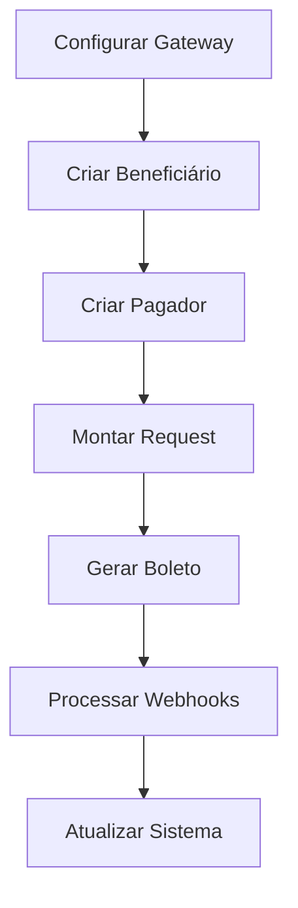

# Documentação - Itaú Boleto PIX

Bem-vindo à documentação completa da biblioteca Itaú Boleto PIX! 📚

## 📋 Índice da Documentação

### 🚀 Começando

- **[README Principal](../README.md)** - Visão geral, instalação rápida e primeiros passos
- **[Guia de Instalação](INSTALLATION.md)** - Instalação detalhada, configuração e testes
- **[Exemplos Práticos](EXAMPLES.md)** - Casos de uso reais e implementações completas

### 📖 Referência Técnica

- **[Referência da API](API_REFERENCE.md)** - Documentação completa de todas as classes, métodos e interfaces
- **[Guia de Webhooks](WEBHOOKS.md)** - Sistema completo de notificações em tempo real
- **[Solução de Problemas](TROUBLESHOOTING.md)** - Diagnóstico e correção de problemas comuns

### 🔧 Desenvolvimento

- **[Guia de Contribuição](../CONTRIBUTING.md)** - Como contribuir com o projeto
- **[Changelog](../CHANGELOG.md)** - Histórico de versões e mudanças

## 🎯 Navegação Rápida

### Para Iniciantes
1. Leia o [README principal](../README.md) para entender o projeto
2. Siga o [Guia de Instalação](INSTALLATION.md) para configurar
3. Execute os [Exemplos Básicos](EXAMPLES.md#exemplos-básicos)
4. Configure os [Webhooks](WEBHOOKS.md#configuração) se necessário

### Para Desenvolvedores Experientes
1. Consulte a [Referência da API](API_REFERENCE.md) para detalhes técnicos
2. Veja os [Exemplos Avançados](EXAMPLES.md#exemplos-avançados) para casos complexos
3. Implemente [Webhooks](WEBHOOKS.md#implementação) para automação
4. Use o [Troubleshooting](TROUBLESHOOTING.md) para resolver problemas

### Para Contribuidores
1. Leia o [Guia de Contribuição](../CONTRIBUTING.md)
2. Configure o ambiente de desenvolvimento
3. Siga os padrões de código estabelecidos
4. Adicione testes e documentação

## 📚 Estrutura da Biblioteca

### Componentes Principais

```
src/
├── Contracts/          # Interfaces e contratos
├── DTOs/              # Data Transfer Objects
├── Enums/             # Enumerações e constantes
├── Exceptions/        # Exceções customizadas
├── Gateways/          # Comunicação com APIs
├── Models/            # Modelos de domínio
├── Services/          # Serviços de negócio
├── Utils/             # Utilitários e helpers
└── Webhooks/          # Sistema de webhooks
```

### Fluxo de Uso



## 🔍 Busca Rápida

### Por Funcionalidade

| Funcionalidade | Documentação |
|---|---|
| **Instalação** | [INSTALLATION.md](INSTALLATION.md) |
| **Configuração** | [README.md](../README.md#configuração) |
| **Boleto Simples** | [EXAMPLES.md](EXAMPLES.md#1-boleto-simples---pessoa-física) |
| **Boleto Avançado** | [EXAMPLES.md](EXAMPLES.md#1-boleto-com-juros-multa-e-desconto) |
| **Webhooks** | [WEBHOOKS.md](WEBHOOKS.md) |
| **Validações** | [API_REFERENCE.md](API_REFERENCE.md#utilitários) |
| **Erros** | [TROUBLESHOOTING.md](TROUBLESHOOTING.md) |

### Por Classe/Interface

| Classe | Documentação |
|---|---|
| `BoletoGenerationService` | [API_REFERENCE.md](API_REFERENCE.md#boletoGenerationservice) |
| `ItauBoletoGateway` | [API_REFERENCE.md](API_REFERENCE.md#itauboletoGateway) |
| `BoletoRequestDTO` | [API_REFERENCE.md](API_REFERENCE.md#boletorequestdto) |
| `BoletoResponseDTO` | [API_REFERENCE.md](API_REFERENCE.md#boletoresponsedto) |
| `Beneficiary` | [API_REFERENCE.md](API_REFERENCE.md#beneficiary) |
| `Payer` | [API_REFERENCE.md](API_REFERENCE.md#payer) |
| `Charge` | [API_REFERENCE.md](API_REFERENCE.md#charge) |
| `ItauWebhookHandler` | [WEBHOOKS.md](WEBHOOKS.md#implementação) |

### Por Caso de Uso

| Caso de Uso | Documentação |
|---|---|
| **E-commerce** | [EXAMPLES.md](EXAMPLES.md#1-e-commerce) |
| **SaaS/Assinatura** | [EXAMPLES.md](EXAMPLES.md#2-sistema-de-assinaturasaas) |
| **Educacional** | [EXAMPLES.md](EXAMPLES.md#3-sistema-educacional) |
| **Cobrança Recorrente** | [EXAMPLES.md](EXAMPLES.md#3-sistema-de-cobrança-recorrente) |
| **Geração em Lote** | [EXAMPLES.md](EXAMPLES.md#2-geração-em-lote) |

## 🛠️ Ferramentas e Recursos

### Utilitários Incluídos

- **DocumentValidator** - Validação de CPF/CNPJ
- **MoneyFormatter** - Formatação de valores monetários
- **DateHelper** - Manipulação de datas e dias úteis
- **UuidHelper** - Geração de identificadores únicos

### Exemplos Prontos

- **Interface Web** - `examples/boleto.php`
- **Uso Básico** - `examples/basic-usage.php`
- **Uso Completo** - `examples/complete-usage.php`

### Scripts de Desenvolvimento

```bash
# Testes
composer test

# Análise estática
composer stan

# Code style
composer cs

# Verificar tudo
composer check-all
```

## 🎓 Tutoriais Passo a Passo

### Tutorial 1: Primeiro Boleto
1. [Instalar a biblioteca](INSTALLATION.md#instalação)
2. [Configurar credenciais](INSTALLATION.md#configurar-variáveis-de-ambiente)
3. [Criar primeiro boleto](EXAMPLES.md#1-boleto-simples---pessoa-física)
4. [Testar no sandbox](INSTALLATION.md#teste-de-geração-de-boleto)

### Tutorial 2: Sistema Completo
1. [Configurar webhooks](WEBHOOKS.md#configuração)
2. [Implementar cobrança avançada](EXAMPLES.md#1-boleto-com-juros-multa-e-desconto)
3. [Processar notificações](WEBHOOKS.md#implementação)
4. [Integrar com banco de dados](EXAMPLES.md#handler-avançado-com-banco-de-dados)

### Tutorial 3: Produção
1. [Configurar ambiente de produção](INSTALLATION.md#configuração)
2. [Implementar logs e monitoramento](TROUBLESHOOTING.md#logs-e-debug)
3. [Configurar retry e fallback](TROUBLESHOOTING.md#retry-automático)
4. [Monitorar saúde da integração](TROUBLESHOOTING.md#como-monitorar-a-saúde-da-integração)

## 🔧 Configurações Avançadas

### Ambientes

| Ambiente | Configuração |
|---|---|
| **Desenvolvimento** | `ITAU_SANDBOX=true` |
| **Homologação** | `ITAU_SANDBOX=true` + dados reais |
| **Produção** | `ITAU_SANDBOX=false` |

### Logs

```php
// Configurar logger personalizado
use Monolog\Logger;
use Monolog\Handler\StreamHandler;

$logger = new Logger('itau-boleto');
$logger->pushHandler(new StreamHandler('logs/itau.log', Logger::DEBUG));

$boletoService = new BoletoGenerationService($gateway, $logger);
```

### Cache de Tokens

```php
// Implementar cache personalizado
class CachedGateway extends ItauBoletoGateway
{
    public function authenticate(): string
    {
        $cacheKey = 'itau_token';
        $token = $this->cache->get($cacheKey);
        
        if (!$token) {
            $token = parent::authenticate();
            $this->cache->set($cacheKey, $token, 3600); // 1 hora
        }
        
        return $token;
    }
}
```

## 📊 Métricas e Monitoramento

### KPIs Importantes

- **Taxa de Sucesso** - Boletos gerados com sucesso
- **Tempo de Resposta** - Latência da API do Itaú
- **Taxa de Pagamento** - Boletos pagos vs gerados
- **Erros por Tipo** - Distribuição de erros

### Implementação

```php
// Exemplo de métricas
class BoletoMetrics
{
    public function recordBoletoGenerated(string $status): void
    {
        $this->incrementCounter("boleto.generated.{$status}");
    }
    
    public function recordApiLatency(float $duration): void
    {
        $this->recordTiming('api.itau.latency', $duration);
    }
}
```

## 🚨 Alertas e Notificações

### Configurar Alertas

- **Taxa de erro > 5%** - Problema na integração
- **Latência > 10s** - Lentidão na API
- **Falha de autenticação** - Problema com certificados
- **Webhook não recebido** - Problema de conectividade

## 📞 Suporte e Comunidade

### Canais Oficiais

- **GitHub Issues** - Bugs e feature requests
- **GitHub Discussions** - Perguntas e discussões
- **Email** - seu@email.com

### Recursos da Comunidade

- **Exemplos Adicionais** - Compartilhados pela comunidade
- **Integrações** - Com frameworks populares
- **Plugins** - Para CMS e e-commerce

## 🎯 Próximos Passos

Após dominar esta documentação:

1. **Implemente** em seu projeto
2. **Contribua** com melhorias
3. **Compartilhe** sua experiência
4. **Monitore** e otimize

## 📝 Feedback

Esta documentação está sempre evoluindo. Contribua com:

- **Correções** - Erros de digitação ou informações incorretas
- **Melhorias** - Explicações mais claras ou exemplos melhores
- **Adições** - Novos casos de uso ou tutoriais
- **Traduções** - Versões em outros idiomas

---

**Boa sorte com sua implementação!** 🚀

Se precisar de ajuda, não hesite em abrir uma issue ou entrar em contato.